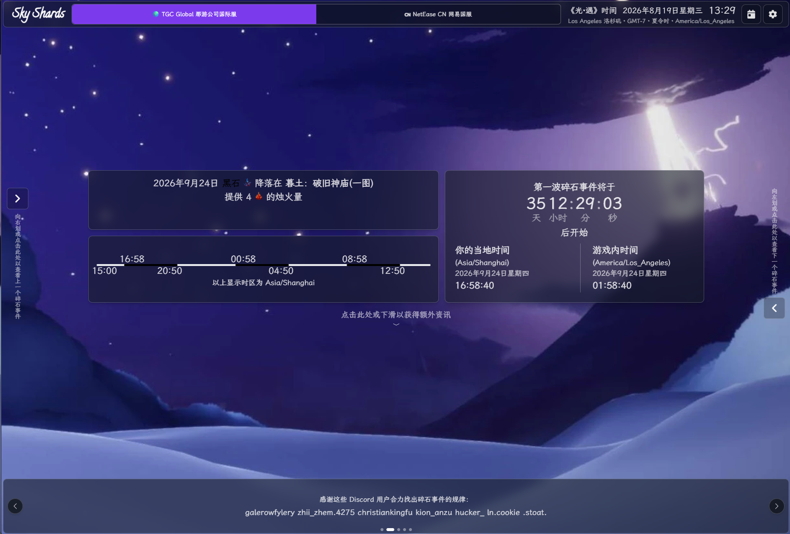
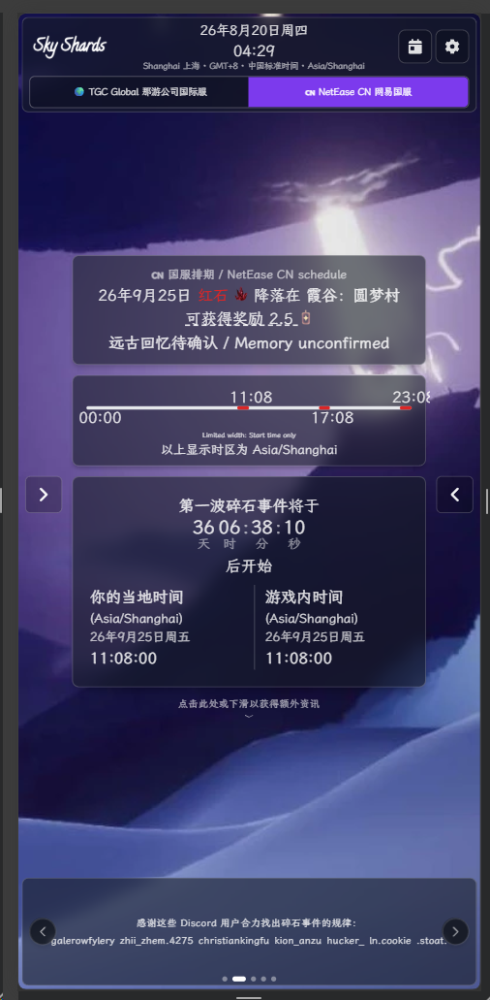

> **[【📖 English README】](README.md)**
> **[【📖 简体中文 阅读我文档】](README.zh-cn.md)**

> **[【📖 English Shard Prediction Rule】](ShardPredictionRule.md)**
> **[【📖 简体中文 碎片预测规则】](ShardPredictionRule.zh-cn.md)**

> **[【📖 English Dual Pages Deployment】](.github/workflows/deploy-pages.md)**
> **[【📖 简体中文 双网页部署】](.github/workflows/deploy-pages.zh-cn.md)**

# 🌠 Sky Shard Web Application

[](https://vincentzyu233.github.io/sky-shards/) [](https://sky-shards-vincentzyu233-fork.pages.dev/)

## 📝 Description

Compute the color, time and location of [Shard Eruptions](https://sky-children-of-the-light.fandom.com/wiki/Shard_Eruptions) in the Game "Sky: Children of the Light".

Shard information follows the [Shard Prediction Rule](./ShardPredictionRule.md), and the implementation is available [here](./src/data/shard.ts).

## 🖼️ Preview

<p align="center">
  
</p>

<p align="center">
  
</p>

## 🌍 Server Capability Differences

Use the server switch beside the logo to choose `🌍 TGC Global 那游公司国际服` or `🇨🇳 NetEase CN 网易国服`. The selected calendar date is preserved when switching, while schedules and countdowns change to the selected server's rules and event timezone.

| Capability                                               | Global | CN  | Notes                                                                                                                                |
| -------------------------------------------------------- | :----: | :-: | ------------------------------------------------------------------------------------------------------------------------------------ |
| Server-specific shard dates, colors, locations and times |   ✅   | ✅  | Global uses TGC rules; CN uses the NetEase schedule adapted from [skyshard_calendar](https://github.com/ichozero/skyshard_calendar). |
| Event timezone and local-time conversion                 |   ✅   | ✅  | Global uses `America/Los_Angeles`; CN uses `Asia/Shanghai`.                                                                          |
| Realm names, map names and general map infographics      |   ✅   | ✅  | These describe shared game content and are reused across both servers.                                                               |
| Shard rewards                                            |   ✅   | ✅  | Each server uses the reward values provided by its corresponding rules.                                                              |
| Community correction for an exceptional day (`override`) |   ✅   | ❌  | The current remote corrections are observations of Global and cannot safely be applied to CN.                                        |
| Confirmed exact landing point (`variation`)              |   ✅   | ❌  | CN shows the general map and marks the exact location as unconfirmed.                                                                |
| Confirmed Ancient Memory for the day (`memory`)          |   ✅   | ❌  | CN retains the six in-game memory definitions but marks the daily selection as unconfirmed.                                          |
| Live shard incident warning                              |   ✅   | ❌  | The current warning feed is maintained for Global and does not represent NetEase operations.                                         |

The ❌ marks mean that this website does not yet have a reliable CN daily observation source. They do not mean that the corresponding location variants, Ancient Memories or incident states do not exist in the CN game client.

## 🌐 Localizations

Google sheet link: [Sky Shard Translation](https://docs.google.com/spreadsheets/d/16eSANTI310SY8uWjsjbxNBzyD-49hwF3OGYRkFPykoo/edit)

Languages will be downloaded into `src/i18n/locales.json` from Google Sheets when the app is built.

## 🧭 Routes

Processed by [Setting Context](./src/context/Settings.tsx)

- `/` - Today's Shard Eruption page
- `/:lang` - Translation
  - Available languages are in [Google Sheet](https://docs.google.com/spreadsheets/d/16eSANTI310SY8uWjsjbxNBzyD-49hwF3OGYRkFPykoo/edit#gid=2102926823)
- Relative day
  - `/:lang/tomorrow`, `/:lang/tmr`, `/tomorrow`, or `/tmr` - Tomorrow's Shard Eruption page
  - `/:lang/yesterday`, `/:lang/ytd`, `/yesterday`, or `/ytd` - Yesterday's Shard Eruption page
- `/:lang/:year/:month/:day` - Shard Eruption page for a specific date

> Names beginning with `:` are placeholders and the colon is not part of the actual URL. Replace `:lang` with a language code such as `en` or `zh`, and replace the date placeholders with the desired date.
>
> Examples:
>
> - `/zh/2026/08/20?server=netease_cn`
> - `/en/2026/08/20?server=tgc_global`
> - `/zh/tomorrow?server=netease_cn`

### ⚙️ Query Parameters

- `server` - Game server (`tgc_global` | `netease_cn`); defaults to `tgc_global`
- `gsTrans` - Fetch Google Sheets translations (`1` | `0`); defaults to `0` and applies only to the current URL
- `twelveHourMode` - Time format (`true` | `false` | `system`); defaults to `system`; legacy `twelveHour` URLs remain supported
- `lightMode` - Color theme (`true` | `false` | `system`); defaults to `system`
- `timezone` - Timezone (`system` | valid [IANA timezone identifier](https://en.wikipedia.org/wiki/List_of_tz_database_time_zones), such as `Asia/Shanghai`); defaults to `system`
- `fontSize` - Content font-size multiplier (positive `number`); defaults to `1`
- `numCols` - Number of columns in the date selector (`5` | `7`); defaults to `5`
- `legTimeline` - Use the legacy timeline display (`1` | `0`); defaults to `1`

> Example: `?server=netease_cn&twelveHourMode=true&fontSize=1.2&legTimeline=0`

## 🛠️ Development

Requirements:

- [Node.js](https://nodejs.org/en/) >= 18
- [pnpm](https://pnpm.io/) >= 8

### 💻 Commands

Enable Corepack for pnpm

```bash
corepack enable
```

Install dependencies

```bash
pnpm install
```

Run the development server

```bash
pnpm dev
```

Build the project

```bash
pnpm build
```

## 🚀 Deployment

GitHub Pages and Cloudflare Pages deployment setup is documented in [【📖 deploy-pages.md】](./.github/workflows/deploy-pages.md).

## 💬 Feedback & Issues

Feel free to open an issue or pull request for any feedback or issues. No need to be formal, just let me know what you think. I will try to respond as soon as possible.

## 📄 License

TL;DR: You can do whatever you want with the code. A link back to this repository or website would be appreciated.

> [!IMPORTANT]
>
> Assets located in `/public/infographics/*`, `/public/ext/*` & `/public/emojis/*` are not covered by this license as they are not created by me.

[【📖 MIT LICENSE】](./LICENSE)
